# How to use Ontology Workbench

This walkthrough uses the built-in example, a (fictional) reading list on GraphRAG research. It follows the six stages in order and ends with exporting RDF you can load into a graph store. Each section says what the stage is for, what to do, and what the screenshot shows.

- [0. Start the app](#0-start-the-app)
- [1. Controlled vocabulary](#1-controlled-vocabulary)
- [2. Metadata profile](#2-metadata-profile)
- [3. Taxonomy](#3-taxonomy)
- [4. Thesaurus](#4-thesaurus)
- [5. Ontology: CBox, TBox, ABox, Check](#5-ontology)
- [6. Knowledge graph: query and draw](#6-knowledge-graph)
- [7. Export the RDF](#7-export-the-rdf)
- [Starting your own project](#starting-your-own-project)
- [Tips](#tips)

---

## 0. Start the app

```bash
npm install
npm run dev
```

Open the URL Vite prints (normally <http://localhost:5173>). The first visit loads the example project. Everything you change is saved in the browser automatically; the small green **saved** mark in the header flashes on each save.

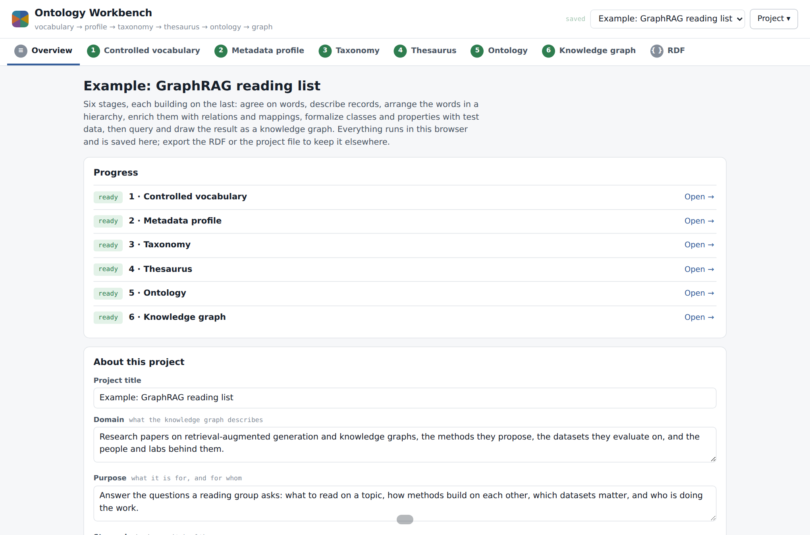

The **stage bar** runs left to right in the order you build things. A green number means the stage has what the next one needs; an amber dot means something is still missing. The **Progress** panel on the Overview says exactly what, with an **Open →** link to each stage.

The **Project** menu creates, renames, exports, imports and deletes projects. The drop-down next to it switches between projects kept in this browser.

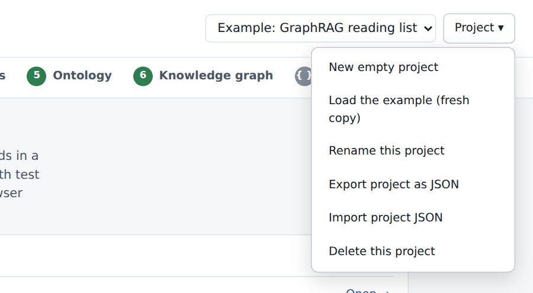

---

## 1. Controlled vocabulary

**Goal:** agree on the words before arranging them. One preferred label per concept, the variants people actually type, a definition, and where the term came from.

1. Fill in **Purpose** and **Out of scope** at the top. Naming what is out of scope keeps the vocabulary from sprawling.
2. Add **Sources** (a glossary, search logs, interviews, a standard).
3. Type a candidate term in **New candidate term** and press Enter.
4. In the editor on the right, set **Status** to `approved`, add **Alternative labels** separated by `;`, and write a **Definition** in the form *X is a [broader kind] that [what sets it apart]*.

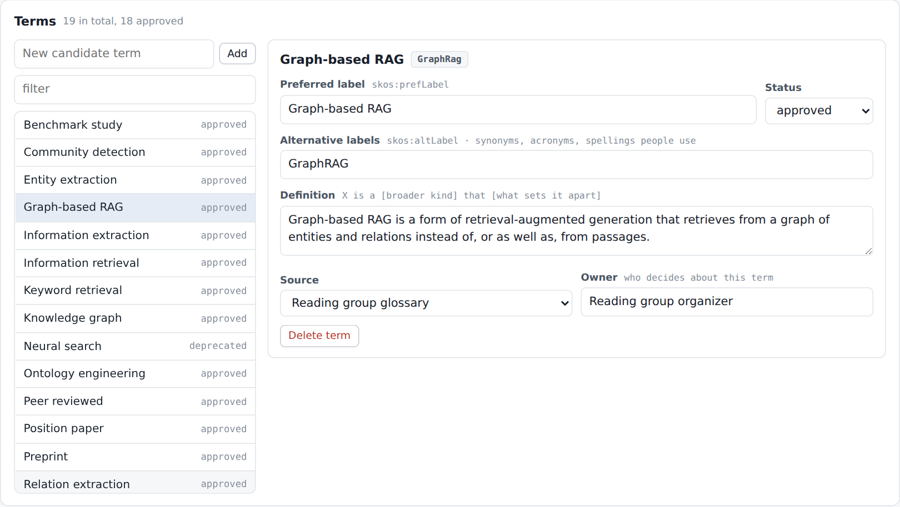

Deprecated terms keep a **Replaced by** link (written as `dct:isReplacedBy`), so old tags still resolve. In the example, *Neural search* is deprecated in favour of *Vector retrieval*.

5. Click **Run the checklist**. It checks duplicate labels, missing or circular definitions, acronyms used as preferred labels, alternative labels that clash with another term, and deprecated terms with no replacement.

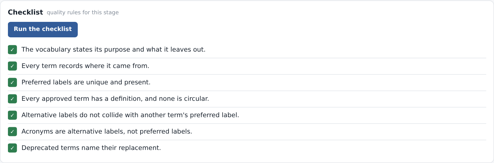

---

## 2. Metadata profile

**Goal:** decide which Dublin Core elements every record carries, and how.

1. Pick an element from **— add a Dublin Core element —** and click **Add element**. Title and identifier are the usual start.
2. For each element set **obligation** (required, recommended, optional), **max** (1 or many) and **encoding**. Choosing *controlled vocabulary* shows checkboxes for the schemes it may draw from (build those in stage 3).
3. Write an **input guideline** and an **example**; these become the data-entry rules.

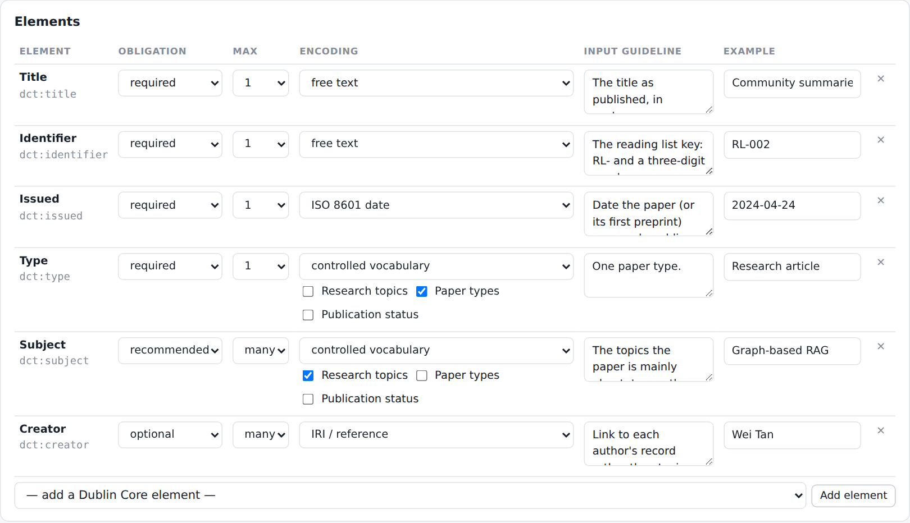

4. Under **Crosswalk**, add each system that holds these records and type the field name used there. This is the join key between systems.

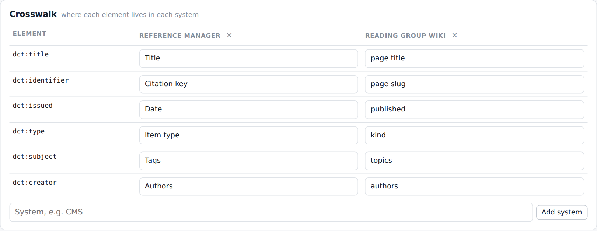

In stage 5 you mark which classes are *records* that must follow this profile; the ontology Check then enforces required elements and maximum counts.

---

## 3. Taxonomy

**Goal:** arrange approved terms into SKOS concept schemes, with a hierarchy where every link is a true *kind of* relation.

1. Add a scheme (**New scheme** → **Add scheme**). Click its heading in the tree to describe its coverage.
2. Approved terms that are not yet placed appear under **Approved, not yet placed**. Click **+** on one to place it in the selected scheme.
3. Click a concept in the tree. Choose its **Broader concept**, then tick the **Is-a test** box to confirm that every child is a kind of the parent. Part-of relations do not belong here; they go in the thesaurus or the ontology.

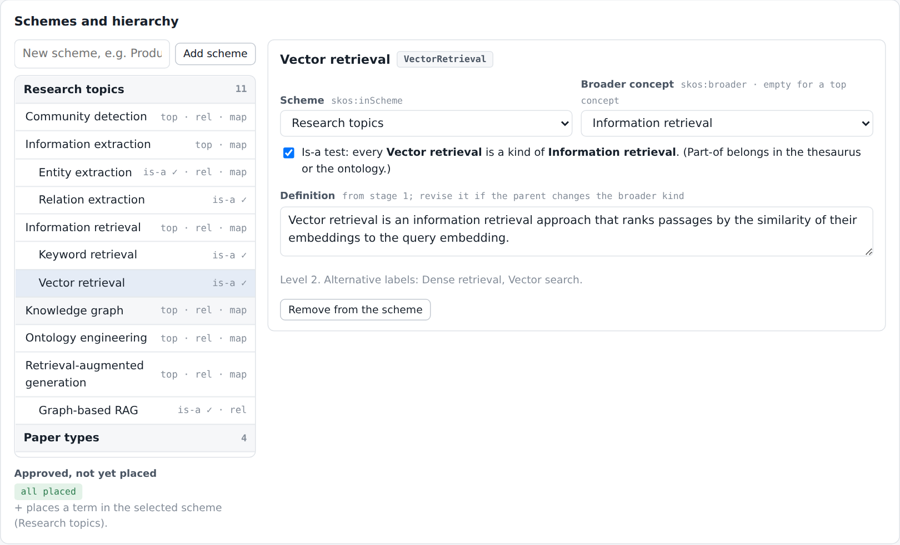

The tree shows `top` for top concepts and `is-a ✓` or `is-a ?` for confirmed and unconfirmed links. The stage stays open (amber dot) until every link is confirmed. The checklist also catches cycles, parents in another scheme, schemes with no top concept, and hierarchies deeper than four levels.

---

## 4. Thesaurus

**Goal:** add what a hierarchy cannot say.

Pick a concept in the tree, then:

- **Related concepts** (`skos:related`): associative links. Adding one also adds the reverse. Concepts already in the same hierarchy are not offered, since that would repeat the tree.
- **Scope note**: where the boundary lies. Write one whenever a concept has several relations.
- **Hidden labels**: misspellings and search-only forms (for example *Grpah RAG*), so search matches them without showing them.
- **Mappings** to outside vocabularies such as DBpedia or Wikidata. Prefer `closeMatch`; real `exactMatch`es are rare.

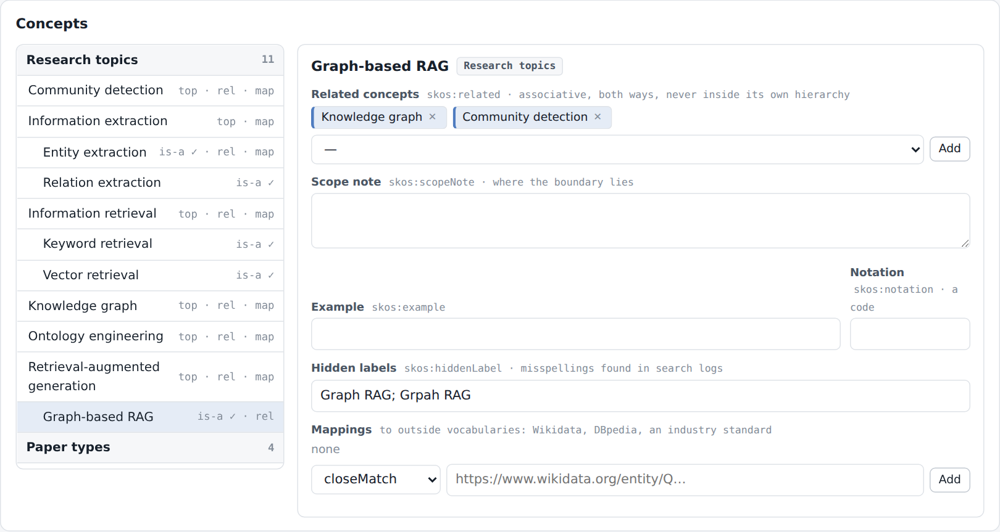

**Collections** (fold-out at the bottom) group concepts for display, such as a reading order, without changing the hierarchy. Ordered collections keep their order in the RDF.

---

## 5. Ontology

Stage 5 has four tabs, done in order.

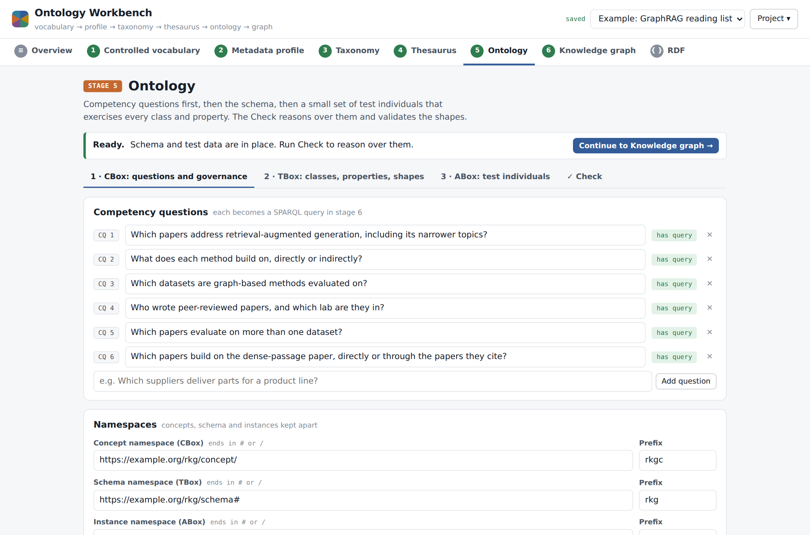

### CBox: questions and governance

1. Write the **competency questions** first: the concrete questions the graph must answer. Each one becomes a SPARQL query in stage 6, and the Check fails if it returns nothing.
2. Set three **namespaces** with prefixes: concepts (CBox), schema (TBox) and instance data (ABox). Each must end in `#` or `/`.
3. Fill in the **ontology record** (title, version, description, creator, license).
4. Tick the **standards to reuse** (PROV-O, FOAF, Schema.org, DCAT). Their classes and properties then appear in every picker.

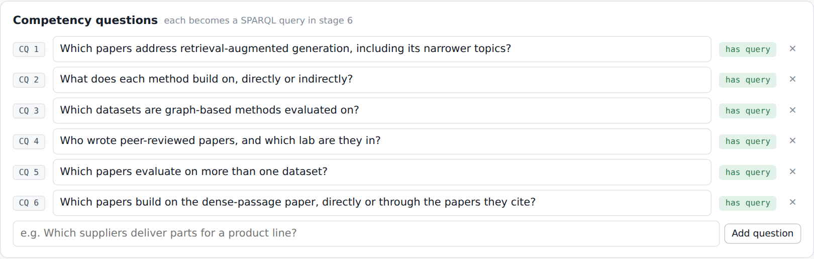

### TBox: classes, properties, shapes

**Classes.** Add a class, or use **Promote a concept to a class** to turn a SKOS concept into an `owl:Class` that keeps a `skos:exactMatch` link back to it. Write the **comment** before anything else. Then add superclasses (your own or from the reused standards), disjoint classes, and the competency question the class serves. Tick **Records of this class follow the stage 2 profile** where it applies.

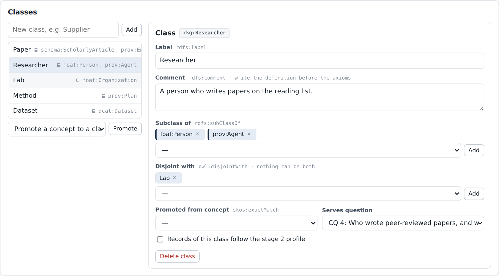

**Properties.** Set domain and range. The range decides the kind:

- a class → object property
- `skos:Concept` → the value is a concept from a scheme (the right choice for statuses, tags and categories)
- an `xsd:` type → datatype property

Object properties can be **functional**, **transitive** and have an **inverse**. Any property can be a subproperty of a standard one; in the example, `authoredBy` is a subproperty of `prov:wasAttributedTo`.

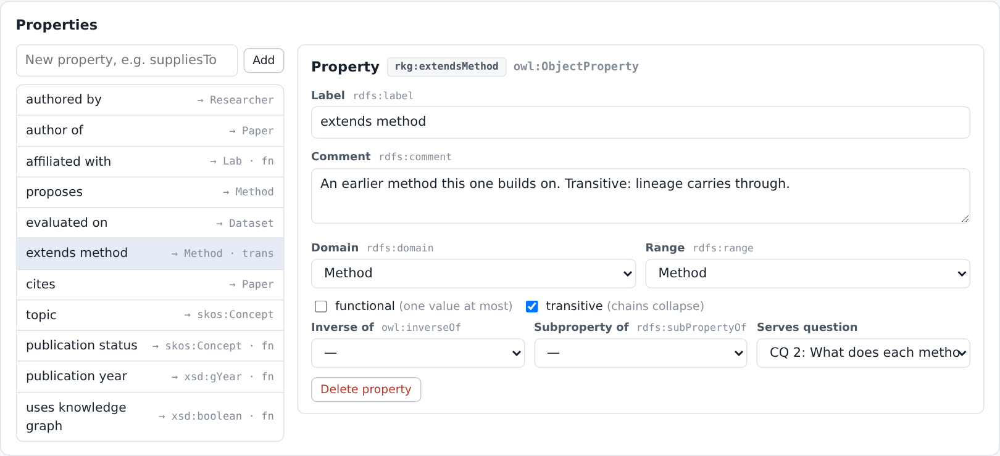

**Shapes.** SHACL shapes state the rules OWL cannot. A shape targets a class and constrains the values along a path of one or two properties: their class or datatype, a required value, and min/max counts. The example's `AuthorLabShape` requires at least one author of every paper to be affiliated with a Lab, a two-step path (`authoredBy` then `affiliatedWith`).

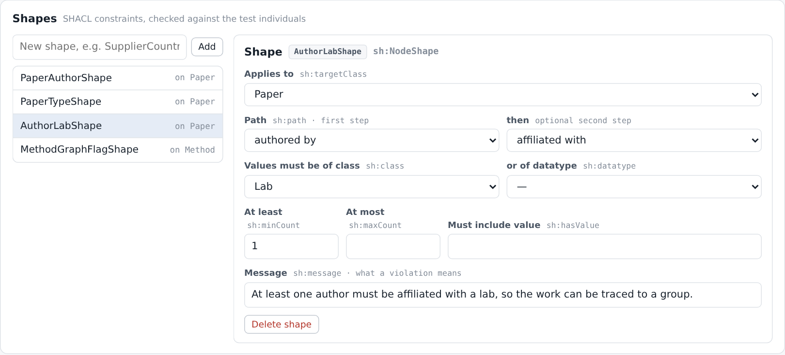

### ABox: test individuals

Create a small, deliberate set of individuals that exercises every class and property. Pick a class and click **New**, give it a label, then add values with the property drop-down. The value control adapts to the range: a list of matching individuals, a list of concepts, a date picker, or a text box.

**Not yet exercised** (bottom left) lists any class or property no individual uses yet.

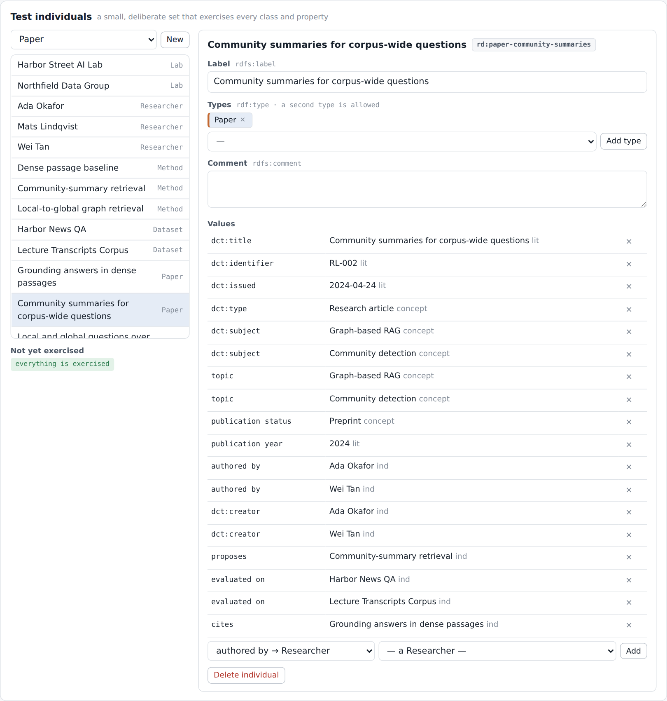

### Check

Click **Run Check**. It:

1. **Reasons** over your data with RDFS (subclass, subproperty, domain, range), `owl:inverseOf` and `owl:TransitiveProperty`.
2. **Checks consistency**: no individual in two disjoint classes, no functional property with two values, and no value outside its range.
3. **Validates every SHACL shape** against the reasoned data.
4. **Runs each competency question** and fails any that return no rows.
5. Checks documentation, coverage and the stage 2 profile obligations.

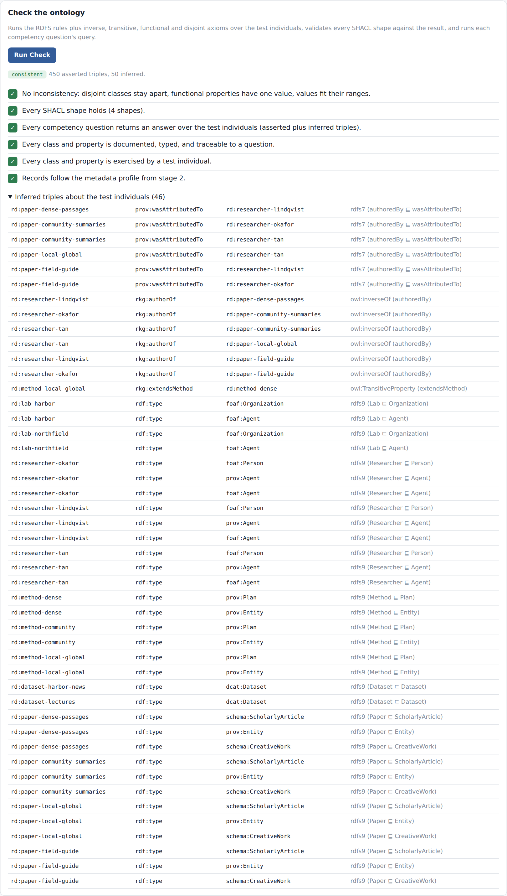

Open **Inferred triples** to see what the reasoner added and which rule added it, for example `rdfs9 (Researcher ⊑ foaf:Person)` or `owl:TransitiveProperty (extendsMethod)`.

When something is wrong, the Check names it. Here a paper was given a second paper type; both the SHACL shape and the profile's *max 1* rule catch it:

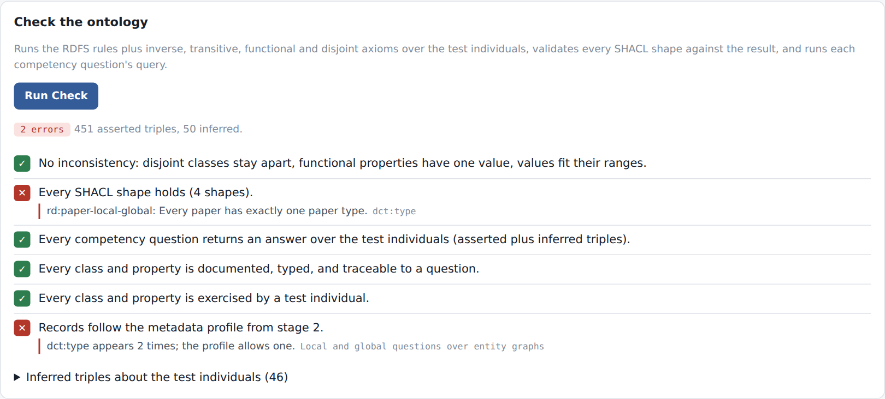

---

## 6. Knowledge graph

### Query

Pick a query from the drop-down: competency questions come first, then ready-made checks (all concepts, the hierarchy, mappings, classes, individuals per class). Edit it freely and click **Run** (or press Ctrl+Enter).

- **include inferred triples** runs the query over asserted plus inferred triples, so subclass and inverse reasoning shows up in answers.
- **Save to question** stores the edited query as that competency question's test, which the Check then runs.

Queries run in Oxigraph, so full SPARQL 1.1 works: property paths (`+`, `*`), `GROUP BY` / `HAVING`, `VALUES`, `BIND`, subqueries, `CONSTRUCT`, `ASK`.

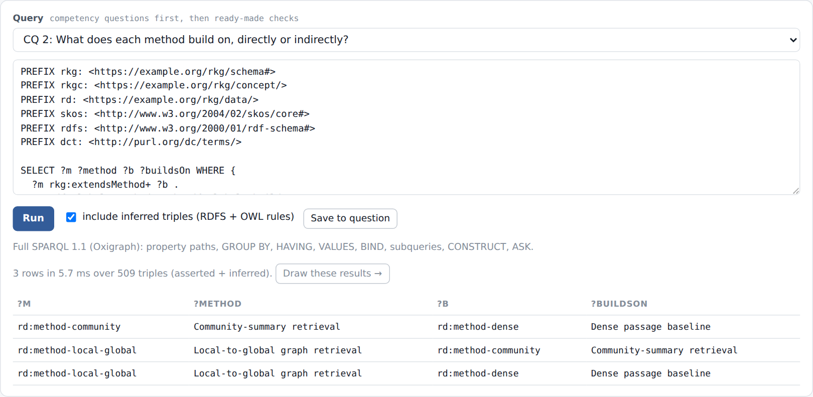

### Graph

When a result contains IRIs, **Draw these results →** draws just those things plus whatever connects them:

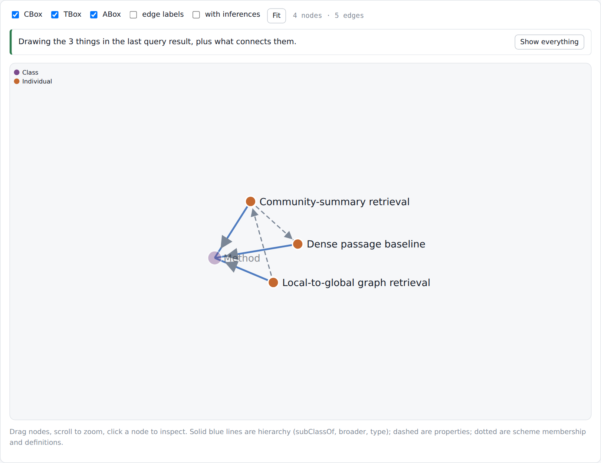

**Show everything** draws the whole project. Use the **CBox / TBox / ABox** toggles to thin it out, **edge labels** to name every edge, and **with inferences** to include reasoned edges. Drag nodes, scroll to zoom, and click a node to see its triples. Solid blue lines are hierarchy (subClassOf, broader, type), dashed lines are properties, and dotted lines are scheme membership.

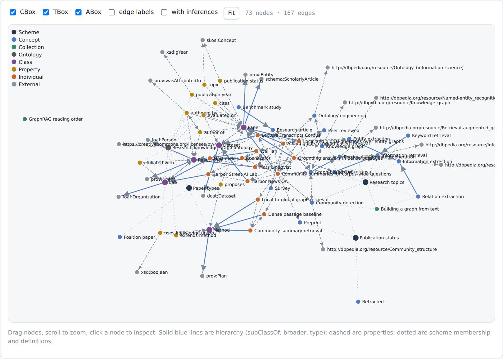

---

## 7. Export the RDF

The **RDF** tab shows the Turtle for one layer at a time (CBox, TBox, ABox, or Everything) and updates as you edit. **Copy** it, or export **.ttl**, **.nt** or **.jsonld**. **Vocabulary .csv** gives a spreadsheet of the terms for review by people who don't read RDF.

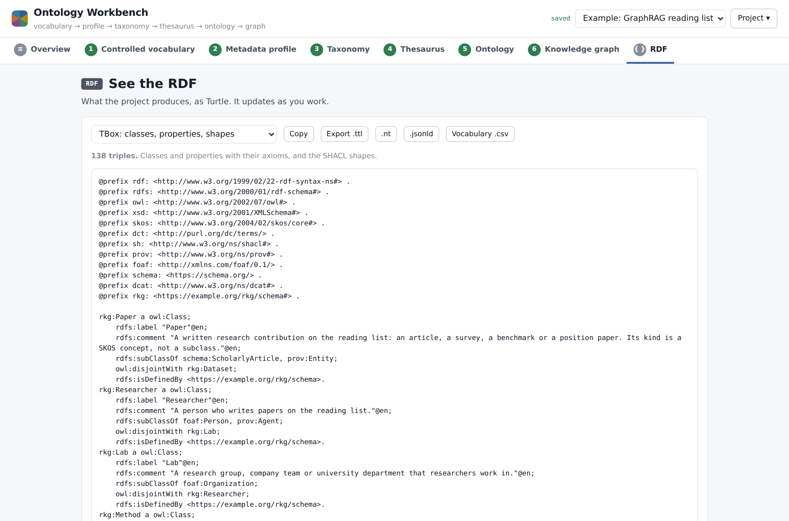

For a GraphRAG pipeline, export **Everything** as Turtle and load it into your store (Neo4j with n10s, GraphDB, Fuseki, Oxigraph server, or `rdflib`):

- the **SKOS labels** (preferred, alternative and hidden) give your entity extractor a controlled label set to normalize mentions to;
- the **TBox** gives it the allowed entity types and relation types;
- the **SHACL shapes** can validate LLM-extracted triples before they enter the graph.

---

## Starting your own project

1. **Project → New empty project**, and give it a name.
2. Work through the stages in order. The **Next** line at the top of each stage says what is still missing; the Overview lists everything.
3. Run each stage's checklist before moving on, and run the ontology **Check** after any change to the TBox or ABox.
4. **Project → Export project as JSON** regularly. Browser storage is per browser and per machine, and clearing site data erases it. **Import project JSON** restores an export.

**Project → Load the example (fresh copy)** adds a clean copy of the example at any time without touching your other projects.

## Tips

- **Identifiers** come from labels: *Graph-based RAG* becomes `GraphBasedRAG` for a concept or class, and *extends method* becomes `extendsMethod` for a property. Labels can change later; identifiers stay.
- **Concepts vs classes**: keep things that only classify (statuses, topics, types) as SKOS concepts and point at them with a property whose range is `skos:Concept`. Promote a concept to a class only when you need reasoning over its members.
- **A second type**: an individual can carry more than one `rdf:type` (**Add type**); disjointness is still enforced.
- **Inferences in queries**: Oxigraph does not reason by itself. If a query misses an answer you expected, tick **include inferred triples**.
